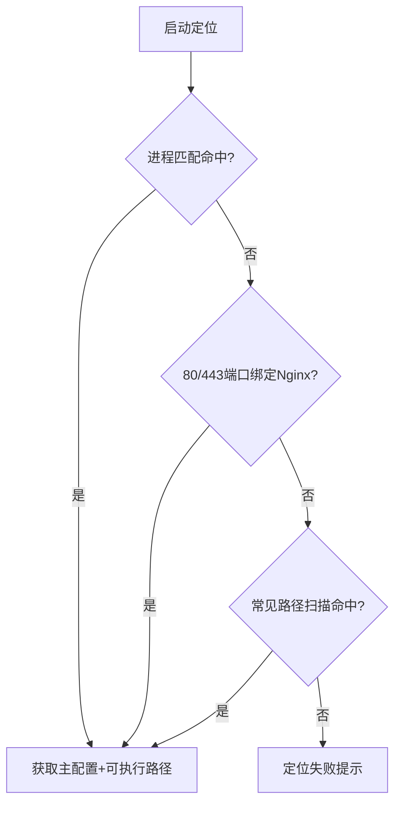
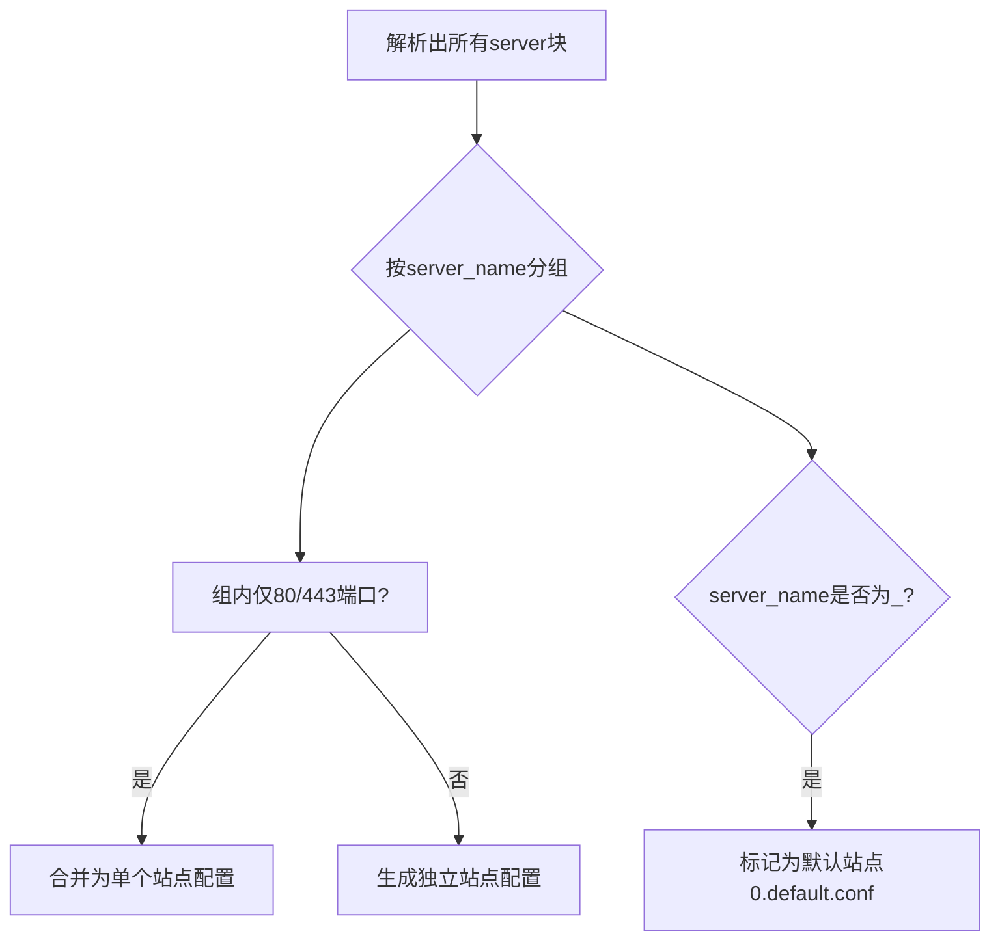

# 第三方 Nginx 接入方案
## 方案概述
本方案核心目标是**读取第三方 Nginx 实例及全量配置文件**，通过解析、分类、重构，生成符合面板规范的配置（支持 PHP 项目、反向代理、静态 HTML 项目），实现第三方 Nginx 无缝对接面板管理。

---

## 一、Nginx 实例定位策略
为确保无遗漏识别第三方 Nginx，采用“递进式定位”方案，依次执行以下三种策略：

### 1. 进程名称匹配
直接扫描系统运行进程，匹配 `nginx` 进程标识。
通过进程信息反推核心路径：可执行文件路径 + 主配置文件（nginx.conf）路径。

### 2. 标准端口监听探测
针对 Web 服务默认端口（80/443）进行端口绑定检测。
定位绑定该端口的 Nginx 进程，进一步推导安装目录及配置文件路径。

### 3. 常见路径兜底扫描
若前两种策略未命中，遍历行业通用安装路径：
- Linux 系统：`/usr/local/nginx/`、`/etc/nginx/`、`/usr/share/nginx/`
- 自定义路径：`/opt/nginx/`、`/home/nginx/`
扫描路径下是否存在 `nginx` 可执行文件及配置目录。

### 定位流程示意图

---

## 二、配置文件全量解析
采用 `pynginx` 解析库，实现配置文件的完整解析：
- 解析范围：主配置文件（nginx.conf）+ 所有通过 `include` 指令引入的子配置文件（含多级嵌套引入）。
- 解析目标：提取配置结构树（全局块、http 块、server 块、location 块等）、指令参数、注释信息。
- 处理逻辑：保留原始配置语义，解决跨文件引用依赖，形成统一的配置数据。

---

## 三、站点配置分离与分类
从解析后的全量配置中，提取所有 `http -> server` 虚拟主机块，按“服务类型”分类、“域名规则”聚合：

### 1. 服务类型判定标准
- **PHP 项目**：配置中存在 `fastcgi_pass` 指令（关联 PHP-FPM 服务）。
- **反向代理项目**：配置中存在 `proxy_pass` 指令（指向后端服务地址）。
- **静态项目**：不满足上述两类条件，默认判定为静态资源服务。

### 2. 虚拟主机聚合规则
- 相同 `server_name` 则合并为一个站点配置（统一管理 HTTP/HTTPS 规则）。
- 通用匹配（`server_name _`）：标记为“默认站点”，配置文件命名为 `0.default.conf`（优先匹配未命中域名的请求）。

### 站点分离逻辑示意图

---

## 四、面板兼容配置生成
基于解析后的原始配置，进行“结构调整 + 功能增强”，生成符合面板使用规范的配置文件：

### 1. 主配置文件调整
- 直接保留：非 `http` 块的所有全局配置（如 `worker_processes`、`error_log` 等）。
- 条件保留：`http` 块中不含 `server` 块的 `include` 文件，原样保留引用；含 `server` 块的 `include` 文件，移除引用并整合核心配置至 `other_http.conf`。
- 强制注入：面板必需的基础指令和标记。

### 2. 站点配置功能增强
- 解析展开：将所有 `include` 引用的子配置直接展开至到对应站点配置中，避免跨文件依赖。
- 插入关键标识位：
  1. SSL 证书申请配置；
  2. SSL 证书插入标识；
  3. 自定义扩展配置区域；
  4. PHP 关联配置（FPM 地址、解析规则、缓存策略统一标准化）。
- 结构重组：按“监听规则 → 域名配置 → 服务类型核心配置 → 扩展配置 → 日志配置”的顺序重新组织，提升可读性与兼容性。

---
## 五、生成接管计划
- 面板站点配置：展示获取到的所有网站配置信息
- 配置文件：在临时文件列表展示生成的配置文件

---